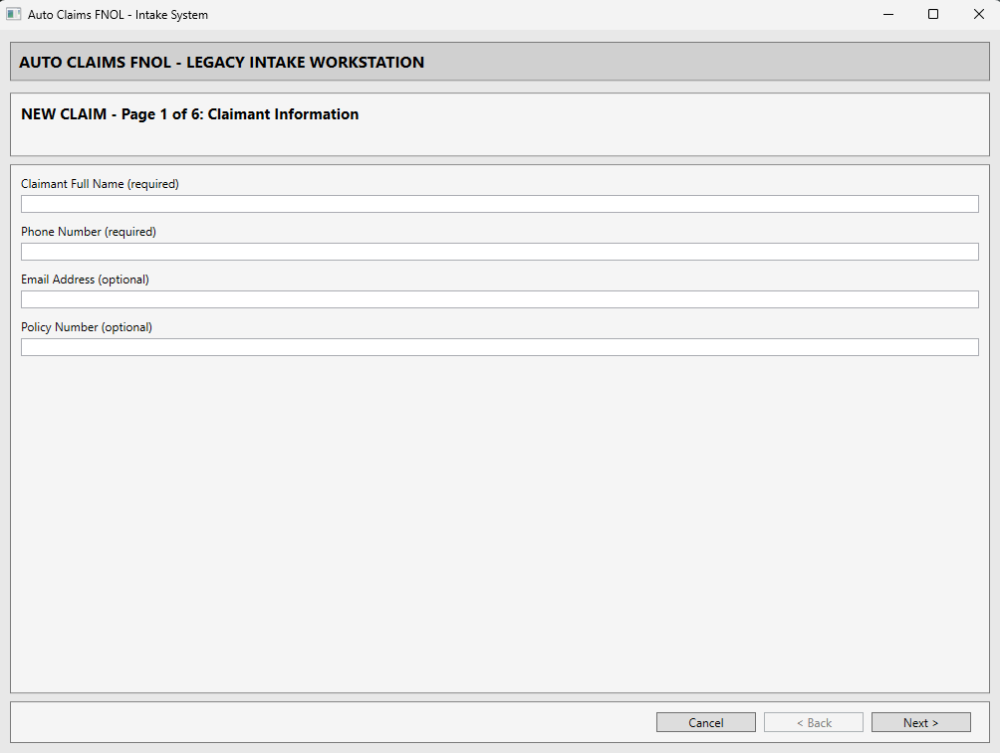

# Auto Claims FNOL — Computer-Use Agent Demo

A legacy **auto insurance claims intake application** built to demonstrate how a Copilot Studio Computer-Use Agent can analyze hand-drawn accident sketches or photos and autonomously fill claim forms in a legacy desktop system.



*The Computer-Use tool drives this legacy WPF intake app screen by screen. Here's Page 1 of the 6-page New Claim flow — "Windows forms-era" styling with required/optional fields and a fixed Back / Next wizard it can reliably navigate.*

**Key capabilities:**
- ✓ Accident image provided as a OneDrive/SharePoint link (hand-drawn sketch or photo)
- ✓ Work IQ Copilot analyzes the image up front, in chat, before any automation
- ✓ Orchestrator confirms every required field with the user, then runs Computer Use once
- ✓ Computer-Use tool fills the multi-page claim form in a single complete pass
- ✓ Hard-block on incomplete image analysis (enforces the form's core value)
- ✓ Agent asks a clarifying question if confidence is low on a critical field
- ✓ Submit to adjuster review queue
- ✓ Resettable for repeat demos

---

## Prerequisites

| Requirement | Details |
|---|---|
| **Microsoft 365 license** | E3/E5 or equivalent with Copilot Studio entitlement |
| **Copilot Studio access** | https://copilotstudio.microsoft.com must be enabled in your tenant |
| **Windows 365 Cloud PC** | Provisioned in the same tenant, with user assigned (or any Windows machine for local testing) |
| **Auto Claims FNOL installed on the PC** | `AutoClaimsFnolApp.exe` deployed (via Intune or manual install). The build is **self-contained** — the .NET 8 runtime is bundled, so the target machine needs **no .NET runtime installed**. |
| **App is runnable by the signed-in user** | The interactive user the agent controls must be able to **execute** `AutoClaimsFnolApp.exe` — no blocking ACL or "you don't have permission to open this file" error. Verify by double-clicking it once as that user. |
| **Computer Use preview enabled** | W365 Agents / Computer Use must be enabled in tenant |
| **Work IQ (Copilot) enabled** | The agent uses Work IQ Copilot to analyze the accident image from its OneDrive/SharePoint link |

---

## Quick Start — Set Up Your Own Demo

### Step 1: Deploy the App

Go to the [latest release](https://github.com/t3blake/auto-claims-fnol-demo/releases/latest) and choose an install method:

#### Option A: Manual Install (Quickest)

1. Download **ManualInstall.zip** from the release
2. Extract the zip
3. Right-click **Install.ps1** → **Run with PowerShell**  
   (Or run from admin terminal: `powershell -ExecutionPolicy Bypass -File Install.ps1`)
4. The script installs to `C:\AutoClaimsFNOL\` and creates a desktop shortcut called "Auto Claims FNOL"

**Even simpler:** If you just want to test locally, extract **all** files from the zip to `C:\AutoClaimsFNOL\` (the app is self-contained, so the exe needs the bundled runtime files alongside it). The agent instructions expect this exact path.

#### Option B: Deploy via Intune

1. Download **AutoClaimsFNOL.intunewin** from the release
2. In **Microsoft Intune admin center**, go to **Apps → Windows → Add → Windows app (Win32)**
3. Upload `AutoClaimsFNOL.intunewin` as the app package file
4. Configure:

   | Setting | Value |
   |---------|-------|
   | **Name** | Auto Claims FNOL |
   | **Description** | Legacy claims intake demo for CUA |
   | **Publisher** | Insurance Demo |
   | **Install command** | `powershell.exe -ExecutionPolicy Bypass -File Install.ps1` |
   | **Uninstall command** | `powershell.exe -ExecutionPolicy Bypass -File Uninstall.ps1` |
   | **Install behavior** | System |
   | **OS architecture** | 64-bit |
   | **Minimum OS** | Windows 10 1903 |

5. For detection rule, upload [`intune/Detect.ps1`](intune/Detect.ps1) from this repo
6. Assign to device or user group as **Required**
7. Wait for install; app will be available at `C:\AutoClaimsFNOL\`

---

### Step 2: Create the Copilot Studio Agent

1. In **Copilot Studio**, create a new agent
2. Configure three instruction areas using files from [`copilot-studio/`](copilot-studio/):

   | Copilot Studio Field | File to Use | How |
   |---------------------|-------------|-----|
   | **Knowledge** | [`copilot-studio/KNOWLEDGE.md`](copilot-studio/KNOWLEDGE.md) | Upload as file |
   | **Agent Instructions** | [`copilot-studio/AGENT-INSTRUCTIONS.md`](copilot-studio/AGENT-INSTRUCTIONS.md) | Copy/paste contents (skip header) |
   | **CUA Tool Instructions** | [`copilot-studio/CUA-TOOL-INSTRUCTIONS.md`](copilot-studio/CUA-TOOL-INSTRUCTIONS.md) | Copy/paste contents (skip header) |

   > **Why three files?** Knowledge is retrieved on demand (token-efficient). Instructions are always in context. Each has a clear role: Knowledge = reference, Agent Instructions = behavior, CUA Tool Instructions = UI interaction.

3. Enable the **Computer Use** tool on the agent
4. Point the agent at the **Windows 365 Cloud PC** (or local machine) where the app is deployed
5. **Enable the Work IQ Copilot (Preview) tool** — this analyzes the accident image from its OneDrive/SharePoint link, up front in chat, before Computer Use runs
6. **Set the two models** — this solution uses two model slots with different jobs:

   | Slot | Where | Recommended | Why |
   |------|-------|-------------|-----|
   | **Orchestrator / agent model** | Agent → Model | **Claude Opus 4.7** | Does the up-front image analysis and reconciliation — vision quality matters here |
   | **Computer Use tool model** | Computer Use tool → Model | **Claude Sonnet 4.5** | Fast, instruction-following form navigation; reasoning-class models only add latency for clicking/typing |

   > The split is deliberate: don't put a slow reasoning model on the Computer Use tool, and don't put a weak vision model on the orchestrator.

7. **Disable web search** — agent has everything it needs in Knowledge + instructions

> **Tip — Token refresh:** Computer-Use connection can expire if Cloud PC session disconnects. Proactively refresh: **Settings → Connections** in Copilot Studio, find Windows 365 connection, click to refresh.

---

### Step 3: Test the Agent

Try these prompts:

| Prompt | What It Tests |
|--------|--------------|
| "I have a sketch of a two-car accident. File a claim for me." | App launch, login, image upload, image analysis, form completion |
| "I have a photo of a T-bone collision at an intersection. What's the claim number?" | Multi-vehicle incident, image analysis, submit, confirmation |
| "My car hit a parked vehicle. Can you report that?" | Single-vehicle incident variant |
| "File a claim and tell me if you have any questions about the incident." | Agent clarification on low confidence |

See [DEMO-WALKTHROUGH.md](DEMO-WALKTHROUGH.md) for fully scripted demo scenarios with talking points.

---

### Step 4: Reset Between Demos

After each demo, delete submitted claims to return to clean state:

1. Log in as admin: `admin` / `admin`
2. Menu: System Administration → Reset Database to Defaults
3. Confirm twice
4. Database cleared, app ready for next demo

Or tell the agent: *"Reset the claims database and prepare for a fresh demo."*

---

### Step 5: Evaluate the Agent (Optional)

Use the built-in **Evaluation** feature in Copilot Studio to validate agent workflow.

1. Open your agent → **Evaluate** in left nav
2. Click **+ New evaluation** → **Import**
3. Import test batches one at a time (run in order, wait for each to finish):

   | CSV File | Tests | Covers |
   |----------|-------|--------|
   | [`evaluation-1-smoke.csv`](copilot-studio/evaluation-1-smoke.csv) | 5 | Launch, login, basic navigation |
   | [`evaluation-2-images.csv`](copilot-studio/evaluation-2-images.csv) | 7 | Image upload, image analysis, extraction |
   | [`evaluation-3-claims.csv`](copilot-studio/evaluation-3-claims.csv) | 7 | End-to-end claim submission, validation |
   | [`evaluation-4-compound.csv`](copilot-studio/evaluation-4-compound.csv) | 4 | Multi-step workflows, clarifications, edge cases |

4. Reset database before running batches 3 and 4
5. For troubleshooting, see [`copilot-studio/EVALUATION.md`](copilot-studio/EVALUATION.md)

> **Important:** Don't run multiple evaluations simultaneously — they share the CUA connection. Run one batch, wait for it to finish, then start the next.

---

## Repository Structure

```
auto-claims-fnol-demo/
├── README.md                          ← You are here
├── DESIGN.md                          ← Architecture & design decisions
├── AGENT-GUIDE.md                     ← Complete screen reference
├── DEMO-WALKTHROUGH.md                ← Scripted demo scenarios
├── LICENSE
│
├── copilot-studio/                    ← Ready-to-paste agent content
│   ├── SETUP-GUIDE.md                 ← Step-by-step agent setup
│   ├── KNOWLEDGE.md
│   ├── AGENT-INSTRUCTIONS.md
│   ├── CUA-TOOL-INSTRUCTIONS.md
│   ├── EVALUATION.md
│   ├── evaluation-1-smoke.csv
│   ├── evaluation-2-images.csv
│   ├── evaluation-3-claims.csv
│   ├── evaluation-4-compound.csv
│   └── Claims Intake Agent/           ← Generated agent export (VS Code Copilot Studio extension)
│
├── src/                               ← C# / .NET 8 WPF source
│   └── AutoClaimsFnolApp/
│
├── intune/                            ← Intune deployment packaging (self-contained build)
│   ├── Build.ps1                      ← Publishes the app + produces AutoClaimsFNOL.intunewin
│   ├── Install.ps1
│   ├── Uninstall.ps1
│   └── Detect.ps1
│
├── docs/images/                       ← Screenshots used in the docs
│
├── .github/workflows/                 ← CI: builds & attaches release assets
│
└── .gitignore
```

> The prebuilt app isn't committed to the repo — download it from the [latest release](https://github.com/t3blake/auto-claims-fnol-demo/releases/latest) (`AutoClaimsFNOL.intunewin` or `ManualInstall.zip`), or build it from source (see below).

---

## Key Details

| Property | Value |
|----------|-------|
| App window title | Auto Claims FNOL - Intake System |
| Desktop shortcut name | Auto Claims FNOL |
| Install path | `C:\AutoClaimsFNOL\` |
| Exe name | `AutoClaimsFnolApp.exe` |
| Default login (adjuster) | `adjuster1` / `pass123` |
| Default login (admin) | `admin` / `admin` |
| Database | SQLite, local file at exe directory, resets via in-app menu |

---

## Additional Documentation

| File | Purpose |
|------|---------|
| [DESIGN.md](DESIGN.md) | Architecture, domain model, design principles, technology decisions |
| [AGENT-GUIDE.md](AGENT-GUIDE.md) | Complete technical reference — all screens, fields, enums, validation, error messages |
| [DEMO-WALKTHROUGH.md](DEMO-WALKTHROUGH.md) | Three fully scripted demo scenarios with talking points for live demos |
| [copilot-studio/EVALUATION.md](copilot-studio/EVALUATION.md) | Test plan, scoring guide, troubleshooting |

---

## Building from Source (Optional)

You only need this if modifying the app itself. For demos, use the pre-built release.

```powershell
# Install .NET 8 SDK (if needed)
# https://dotnet.microsoft.com/download/dotnet/8.0

# Run in development mode
cd src
dotnet run

# Rebuild the self-contained Intune package (publishes the app with the .NET
# runtime bundled, stages it, and produces AutoClaimsFNOL.intunewin)
cd ..\intune
.\Build.ps1
```

---

## Related Repos

| Repo | Purpose |
|------|---------|
| [cobol-banker-demo](https://github.com/t3blake/cobol-banker-demo) | Legacy banking terminal demo (inspiration for CUA interaction patterns) |

---

## License

MIT
